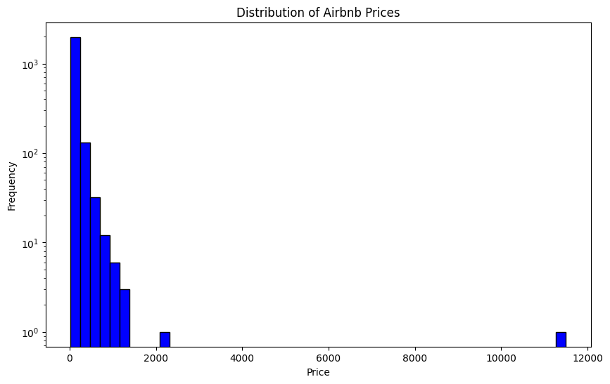
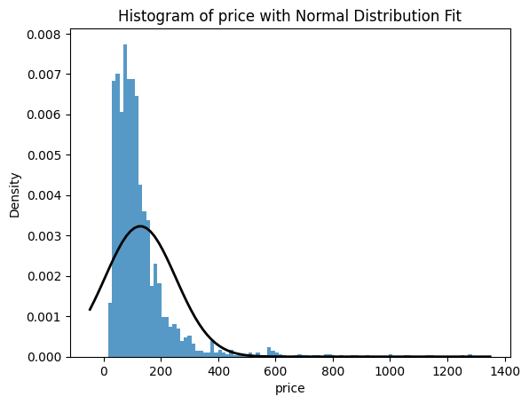
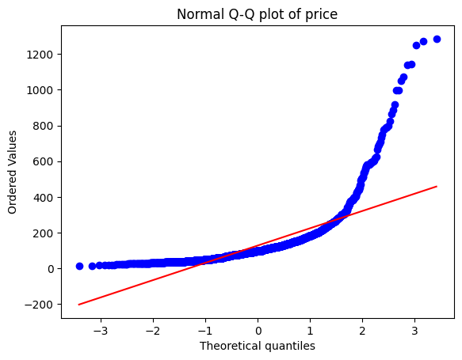
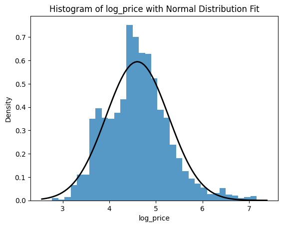
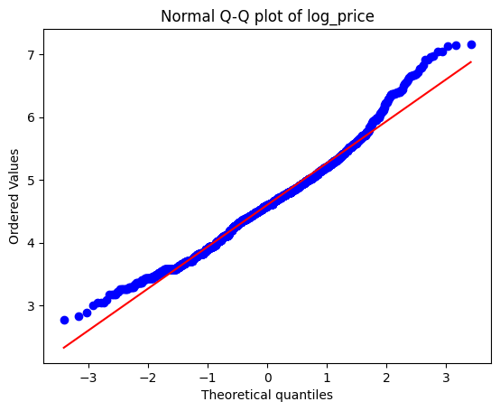

```python
import pandas as pd
import numpy as np
import re

import matplotlib.pyplot as plt
import seaborn as sns

from numpy.linalg import norm
from scipy.stats import norm, probplot
from scipy.spatial import cKDTree
from geopy.distance import geodesic

from sklearn.preprocessing import LabelEncoder, StandardScaler, OneHotEncoder
from sklearn.model_selection import train_test_split
from sklearn.compose import ColumnTransformer
from sklearn.feature_selection import RFE
from sklearn.linear_model import LinearRegression, Ridge, Lasso
from sklearn.ensemble import RandomForestRegressor, GradientBoostingRegressor
from sklearn.metrics import mean_squared_error, r2_score

import warnings
warnings.filterwarnings('ignore')
```

# 1. Import data

This analysis uses Bristol Airbnb listing data to predict rental prices through machine learning techniques. The dataset contains comprehensive information about Airbnb properties including location data, host characteristics, property features, and pricing information. Initial data exploration reveals 75 columns with 2,167 listings after removing entries without price information.


```python
data = pd.read_csv('./input/airbnbs.csv')
```


```python
data.head(3)
```


<div>
<style scoped>
    .dataframe tbody tr th:only-of-type {
        vertical-align: middle;
    }

    .dataframe tbody tr th {
        vertical-align: top;
    }

    .dataframe thead th {
        text-align: right;
    }
</style>
<table border="1" class="dataframe">
  <thead>
    <tr style="text-align: right;">
      <th></th>
      <th>id</th>
      <th>listing_url</th>
      <th>scrape_id</th>
      <th>last_scraped</th>
      <th>source</th>
      <th>name</th>
      <th>description</th>
      <th>neighborhood_overview</th>
      <th>picture_url</th>
      <th>host_id</th>
      <th>...</th>
      <th>review_scores_communication</th>
      <th>review_scores_location</th>
      <th>review_scores_value</th>
      <th>license</th>
      <th>instant_bookable</th>
      <th>calculated_host_listings_count</th>
      <th>calculated_host_listings_count_entire_homes</th>
      <th>calculated_host_listings_count_private_rooms</th>
      <th>calculated_host_listings_count_shared_rooms</th>
      <th>reviews_per_month</th>
    </tr>
  </thead>
  <tbody>
    <tr>
      <th>0</th>
      <td>70820</td>
      <td>https://www.airbnb.com/rooms/70820</td>
      <td>20231225202604</td>
      <td>2023-12-25</td>
      <td>city scrape</td>
      <td>Townhouse in Bristol · ★4.77 · 1 bedroom · 1 b...</td>
      <td>NaN</td>
      <td>The neighbourhood is friendly and welcoming; m...</td>
      <td>https://a0.muscache.com/pictures/b33c30be-56a0...</td>
      <td>360195</td>
      <td>...</td>
      <td>4.94</td>
      <td>4.76</td>
      <td>4.76</td>
      <td>NaN</td>
      <td>f</td>
      <td>5</td>
      <td>0</td>
      <td>5</td>
      <td>0</td>
      <td>1.52</td>
    </tr>
    <tr>
      <th>1</th>
      <td>117122</td>
      <td>https://www.airbnb.com/rooms/117122</td>
      <td>20231225202604</td>
      <td>2023-12-25</td>
      <td>city scrape</td>
      <td>Condo in Bristol · ★4.96 · 1 bedroom · 1 bed ·...</td>
      <td>NaN</td>
      <td>This area is on the water and has splendid vie...</td>
      <td>https://a0.muscache.com/pictures/13b41142-0946...</td>
      <td>591555</td>
      <td>...</td>
      <td>4.99</td>
      <td>4.97</td>
      <td>4.88</td>
      <td>NaN</td>
      <td>f</td>
      <td>1</td>
      <td>0</td>
      <td>1</td>
      <td>0</td>
      <td>1.18</td>
    </tr>
    <tr>
      <th>2</th>
      <td>176306</td>
      <td>https://www.airbnb.com/rooms/176306</td>
      <td>20231225202604</td>
      <td>2023-12-25</td>
      <td>city scrape</td>
      <td>Townhouse in Bristol · ★4.79 · 1 bedroom · 1 b...</td>
      <td>NaN</td>
      <td>Southville is pretty darn hip, frankly. North ...</td>
      <td>https://a0.muscache.com/pictures/e1e7fdfc-9db5...</td>
      <td>708175</td>
      <td>...</td>
      <td>4.94</td>
      <td>4.78</td>
      <td>4.74</td>
      <td>NaN</td>
      <td>f</td>
      <td>1</td>
      <td>0</td>
      <td>1</td>
      <td>0</td>
      <td>0.39</td>
    </tr>
  </tbody>
</table>
<p>3 rows × 75 columns</p>
</div>


# 2. Date cleaning

First, columns with all missing values and columns with only one unique value are removed as they provide no predictive value. Additionally, listings without price information are excluded from the analysis, ensuring all remaining entries have the target variable available. This preprocessing reduces the dataset to 67 meaningful columns while maintaining data integrity.


```python
# remove meaningless columns
data = data.dropna(axis=1, how='all')

unique_counts = data.nunique()

data = data.loc[:, unique_counts > 1]
```


```python
# delect the rows without price
data = data.dropna(subset=['price'])
```


```python
data.head(3)
```


<div>
<style scoped>
    .dataframe tbody tr th:only-of-type {
        vertical-align: middle;
    }

    .dataframe tbody tr th {
        vertical-align: top;
    }

    .dataframe thead th {
        text-align: right;
    }
</style>
<table border="1" class="dataframe">
  <thead>
    <tr style="text-align: right;">
      <th></th>
      <th>id</th>
      <th>listing_url</th>
      <th>last_scraped</th>
      <th>source</th>
      <th>name</th>
      <th>neighborhood_overview</th>
      <th>picture_url</th>
      <th>host_id</th>
      <th>host_url</th>
      <th>host_name</th>
      <th>...</th>
      <th>review_scores_checkin</th>
      <th>review_scores_communication</th>
      <th>review_scores_location</th>
      <th>review_scores_value</th>
      <th>instant_bookable</th>
      <th>calculated_host_listings_count</th>
      <th>calculated_host_listings_count_entire_homes</th>
      <th>calculated_host_listings_count_private_rooms</th>
      <th>calculated_host_listings_count_shared_rooms</th>
      <th>reviews_per_month</th>
    </tr>
  </thead>
  <tbody>
    <tr>
      <th>0</th>
      <td>70820</td>
      <td>https://www.airbnb.com/rooms/70820</td>
      <td>2023-12-25</td>
      <td>city scrape</td>
      <td>Townhouse in Bristol · ★4.77 · 1 bedroom · 1 b...</td>
      <td>The neighbourhood is friendly and welcoming; m...</td>
      <td>https://a0.muscache.com/pictures/b33c30be-56a0...</td>
      <td>360195</td>
      <td>https://www.airbnb.com/users/show/360195</td>
      <td>Sarah</td>
      <td>...</td>
      <td>4.95</td>
      <td>4.94</td>
      <td>4.76</td>
      <td>4.76</td>
      <td>f</td>
      <td>5</td>
      <td>0</td>
      <td>5</td>
      <td>0</td>
      <td>1.52</td>
    </tr>
    <tr>
      <th>1</th>
      <td>117122</td>
      <td>https://www.airbnb.com/rooms/117122</td>
      <td>2023-12-25</td>
      <td>city scrape</td>
      <td>Condo in Bristol · ★4.96 · 1 bedroom · 1 bed ·...</td>
      <td>This area is on the water and has splendid vie...</td>
      <td>https://a0.muscache.com/pictures/13b41142-0946...</td>
      <td>591555</td>
      <td>https://www.airbnb.com/users/show/591555</td>
      <td>Marcus</td>
      <td>...</td>
      <td>5.00</td>
      <td>4.99</td>
      <td>4.97</td>
      <td>4.88</td>
      <td>f</td>
      <td>1</td>
      <td>0</td>
      <td>1</td>
      <td>0</td>
      <td>1.18</td>
    </tr>
    <tr>
      <th>2</th>
      <td>176306</td>
      <td>https://www.airbnb.com/rooms/176306</td>
      <td>2023-12-25</td>
      <td>city scrape</td>
      <td>Townhouse in Bristol · ★4.79 · 1 bedroom · 1 b...</td>
      <td>Southville is pretty darn hip, frankly. North ...</td>
      <td>https://a0.muscache.com/pictures/e1e7fdfc-9db5...</td>
      <td>708175</td>
      <td>https://www.airbnb.com/users/show/708175</td>
      <td>Orla</td>
      <td>...</td>
      <td>4.98</td>
      <td>4.94</td>
      <td>4.78</td>
      <td>4.74</td>
      <td>f</td>
      <td>1</td>
      <td>0</td>
      <td>1</td>
      <td>0</td>
      <td>0.39</td>
    </tr>
  </tbody>
</table>
<p>3 rows × 67 columns</p>
</div>


```python
column_names = data.columns
print(column_names)
```

    Index(['id', 'listing_url', 'last_scraped', 'source', 'name',
           'neighborhood_overview', 'picture_url', 'host_id', 'host_url',
           'host_name', 'host_since', 'host_location', 'host_about',
           'host_response_time', 'host_response_rate', 'host_acceptance_rate',
           'host_is_superhost', 'host_thumbnail_url', 'host_picture_url',
           'host_neighbourhood', 'host_listings_count',
           'host_total_listings_count', 'host_verifications',
           'host_has_profile_pic', 'host_identity_verified', 'neighbourhood',
           'neighbourhood_cleansed', 'latitude', 'longitude', 'property_type',
           'room_type', 'accommodates', 'bathrooms_text', 'beds', 'price',
           'minimum_nights', 'maximum_nights', 'minimum_minimum_nights',
           'maximum_minimum_nights', 'minimum_maximum_nights',
           'maximum_maximum_nights', 'minimum_nights_avg_ntm',
           'maximum_nights_avg_ntm', 'has_availability', 'availability_30',
           'availability_60', 'availability_90', 'availability_365',
           'calendar_last_scraped', 'number_of_reviews', 'number_of_reviews_ltm',
           'number_of_reviews_l30d', 'first_review', 'last_review',
           'review_scores_rating', 'review_scores_accuracy',
           'review_scores_cleanliness', 'review_scores_checkin',
           'review_scores_communication', 'review_scores_location',
           'review_scores_value', 'instant_bookable',
           'calculated_host_listings_count',
           'calculated_host_listings_count_entire_homes',
           'calculated_host_listings_count_private_rooms',
           'calculated_host_listings_count_shared_rooms', 'reviews_per_month'],
          dtype='object')


# 3. Basic Features Choosing

Feature selection focuses on variables most relevant to price prediction, including geographic coordinates (latitude, longitude), neighborhood information, host characteristics, property specifications, and review metrics. Key features include property type, room type, number of beds and bathrooms, accommodation capacity, minimum nights requirement, review scores across multiple dimensions, and calculated host listing counts.


```python
data_need = data[['latitude', 'longitude','neighbourhood_cleansed','host_is_superhost', 'property_type', 'room_type', 'bathrooms_text', 'beds', 'minimum_nights',
'number_of_reviews', 'number_of_reviews_ltm', 'last_review', 'first_review',
'review_scores_rating', 'review_scores_accuracy', 'review_scores_cleanliness', 
'review_scores_checkin', 'review_scores_communication', 'review_scores_location', 
'review_scores_value', 'instant_bookable', 'reviews_per_month', 'calculated_host_listings_count',
'calculated_host_listings_count_entire_homes', 'calculated_host_listings_count_private_rooms', 
'calculated_host_listings_count_shared_rooms','accommodates', 'price']]
```

# 4. Preprocessing 'Price' vlaue

Target value 'Pirce' initial analysis reveals severe right skewness (4.23) and high kurtosis (25.45), indicating non-normal distribution with extreme outliers. Outliers above $2,000 are removed to reduce noise. Subsequently, log transformation (log1p) is applied to normalize the distribution, resulting in substantially improved skewness (0.48) and kurtosis (0.65), making the target variable more suitable for regression modeling.


```python
data_need['price'] = data_need['price'].str.replace('$', '', regex=False).str.replace(',', '', regex=False).astype(float)
```


```python
# change to boxplot
plt.figure(figsize=(10, 6))
plt.hist(data_need['price'], bins=50, color='blue', edgecolor='black')
plt.title('Distribution of Airbnb Prices')
plt.xlabel('Price')
plt.ylabel('Frequency')
plt.yscale('log')  # Using a log scale for better visualization of the distribution
plt.show()
```


    

    


```python
data_need = data_need.drop(data_need[data_need['price'] > 2000].index)
```


```python
# Draw a histogram and fit a normal distribution curve
sns.histplot(data_need['price'], kde=False, stat="density", linewidth=0)
plt.xlabel('price')
plt.ylabel('Density')
plt.title('Histogram of price with Normal Distribution Fit')

# Overlay a normal distribution curve on the histogram
xmin, xmax = plt.xlim()
x = np.linspace(xmin, xmax, 100)
p = norm.pdf(x, data_need['price'].mean(), data_need['price'].std())
plt.plot(x, p, 'k', linewidth=2)

plt.show()

fig = plt.figure()
res = probplot(data_need['price'], plot=plt)
plt.title('Normal Q-Q plot of price')
plt.show()

print("Skewness: %f" % data_need['price'].skew())
print("Kurtosis: %f" % data_need['price'].kurt())
```


    

    


    

    


    Skewness: 4.228017
    Kurtosis: 25.451396


```python
data_need['log_price'] = np.log1p(data_need['price'])
```


```python
# Draw a histogram and fit a normal distribution curve
sns.histplot(data_need['log_price'], kde=False, stat="density", linewidth=0)
plt.xlabel('log_price')
plt.ylabel('Density')
plt.title('Histogram of log_price with Normal Distribution Fit')

# Overlay a normal distribution curve on the histogram
xmin, xmax = plt.xlim()
x = np.linspace(xmin, xmax, 100)
p = norm.pdf(x, data_need['log_price'].mean(), data_need['log_price'].std())
plt.plot(x, p, 'k', linewidth=2)

plt.show()

# Draw a normal probability plot
fig = plt.figure()
res = probplot(data_need['log_price'], plot=plt)
plt.title('Normal Q-Q plot of log_price')
plt.show()

# Calculate the skewness and kurtosis after transformation
print("Skewness: %f" % data_need['log_price'].skew())
print("Kurtosis: %f" % data_need['log_price'].kurt())
```


    

    


    

    


    Skewness: 0.477380
    Kurtosis: 0.648204


# 5. Preprocessing Features

Feature engineering involves multiple transformations to optimize data for machine learning. Property types are grouped into broader categories (Entire Home, Entire Apartment, Private Room, etc.) to reduce dimensionality. Bathroom information is parsed using regex to extract separate counts for shared and private bathrooms. Rating and bedroom information are extracted from listing names using pattern matching. Date variables are converted to temporal features measuring days since first and last reviews. Missing values are handled through median imputation for numerical features and mode imputation for categorical variables. Finally, categorical variables are label-encoded for model compatibility.


```python
pd.set_option('display.max_rows', None)
data_need.agg(['unique']).transpose()
```


<div>
<style scoped>
    .dataframe tbody tr th:only-of-type {
        vertical-align: middle;
    }

    .dataframe tbody tr th {
        vertical-align: top;
    }

    .dataframe thead th {
        text-align: right;
    }
</style>
<table border="1" class="dataframe">
  <thead>
    <tr style="text-align: right;">
      <th></th>
      <th>unique</th>
    </tr>
  </thead>
  <tbody>
    <tr>
      <th>latitude</th>
      <td>[51.43843, 51.44976, 51.44174, 51.46487, 51.44...</td>
    </tr>
    <tr>
      <th>longitude</th>
      <td>[-2.59183, -2.61, -2.60297, -2.5569, -2.55783,...</td>
    </tr>
    <tr>
      <th>neighbourhood_cleansed</th>
      <td>[Windmill Hill, Hotwells &amp; Harbourside, Southv...</td>
    </tr>
    <tr>
      <th>host_is_superhost</th>
      <td>[f, t, nan]</td>
    </tr>
    <tr>
      <th>property_type</th>
      <td>[Private room in townhouse, Private room in co...</td>
    </tr>
    <tr>
      <th>room_type</th>
      <td>[Private room, Entire home/apt, Hotel room, Sh...</td>
    </tr>
    <tr>
      <th>bathrooms_text</th>
      <td>[1 shared bath, 2.5 shared baths, 1.5 shared b...</td>
    </tr>
    <tr>
      <th>beds</th>
      <td>[1.0, 2.0, 3.0, 4.0, 6.0, nan, 5.0, 8.0, 14.0,...</td>
    </tr>
    <tr>
      <th>minimum_nights</th>
      <td>[3, 1, 5, 6, 2, 4, 7, 20, 90, 30, 10, 12, 28, ...</td>
    </tr>
    <tr>
      <th>number_of_reviews</th>
      <td>[189, 180, 53, 34, 59, 84, 101, 330, 194, 436,...</td>
    </tr>
    <tr>
      <th>number_of_reviews_ltm</th>
      <td>[11, 9, 10, 3, 8, 12, 18, 4, 42, 43, 23, 45, 3...</td>
    </tr>
    <tr>
      <th>last_review</th>
      <td>[2023-11-29, 2023-11-26, 2023-12-12, 2023-12-2...</td>
    </tr>
    <tr>
      <th>first_review</th>
      <td>[2013-10-18, 2011-07-04, 2012-11-18, 2017-06-0...</td>
    </tr>
    <tr>
      <th>review_scores_rating</th>
      <td>[4.77, 4.96, 4.79, 4.65, 4.89, 4.64, 4.87, 4.9...</td>
    </tr>
    <tr>
      <th>review_scores_accuracy</th>
      <td>[4.89, 4.94, 4.72, 4.84, 4.88, 4.57, 4.99, 4.9...</td>
    </tr>
    <tr>
      <th>review_scores_cleanliness</th>
      <td>[4.68, 4.98, 4.46, 4.74, 4.91, 4.89, 4.84, 4.6...</td>
    </tr>
    <tr>
      <th>review_scores_checkin</th>
      <td>[4.95, 5.0, 4.98, 4.94, 4.82, 4.96, 4.97, 4.93...</td>
    </tr>
    <tr>
      <th>review_scores_communication</th>
      <td>[4.94, 4.99, 4.77, 4.93, 4.86, 4.97, 4.96, 4.9...</td>
    </tr>
    <tr>
      <th>review_scores_location</th>
      <td>[4.76, 4.97, 4.78, 4.81, 4.72, 4.59, 4.79, 4.8...</td>
    </tr>
    <tr>
      <th>review_scores_value</th>
      <td>[4.76, 4.88, 4.74, 4.65, 4.84, 4.62, 4.9, 4.73...</td>
    </tr>
    <tr>
      <th>instant_bookable</th>
      <td>[f, t]</td>
    </tr>
    <tr>
      <th>reviews_per_month</th>
      <td>[1.52, 1.18, 0.39, 0.43, 0.41, 0.6, 0.73, 2.33...</td>
    </tr>
    <tr>
      <th>calculated_host_listings_count</th>
      <td>[5, 1, 3, 2, 4, 6, 160, 13, 7, 47, 14, 57, 10,...</td>
    </tr>
    <tr>
      <th>calculated_host_listings_count_entire_homes</th>
      <td>[0, 1, 2, 3, 5, 146, 9, 7, 47, 14, 6, 56, 4, 1...</td>
    </tr>
    <tr>
      <th>calculated_host_listings_count_private_rooms</th>
      <td>[5, 1, 2, 0, 3, 4, 6, 8]</td>
    </tr>
    <tr>
      <th>calculated_host_listings_count_shared_rooms</th>
      <td>[0, 3]</td>
    </tr>
    <tr>
      <th>accommodates</th>
      <td>[2, 1, 3, 5, 4, 10, 8, 9, 7, 6, 16, 14, 13, 15...</td>
    </tr>
    <tr>
      <th>price</th>
      <td>[44.0, 111.0, 35.0, 38.0, 52.0, 80.0, 110.0, 2...</td>
    </tr>
    <tr>
      <th>log_price</th>
      <td>[3.8066624897703196, 4.718498871295094, 3.5835...</td>
    </tr>
  </tbody>
</table>
</div>


```python
dict1 = {'Entire Home': ['Entire home', 'Entire townhouse', 'Entire guesthouse', 'Entire cottage', 
                    'Entire villa', 'Entire vacation home', 'Entire bungalow', 'Entire cabin', 
                    'Entire loft'],
        'Entire Apartment': ['Entire rental unit', 'Entire condo', 'Entire serviced apartment', 
                         'Entire guest suite'],
    'Private Room': ['Private room in home', 'Private room in rental unit', 'Private room in townhouse', 
                     'Private room in condo', 'Private room in bed and breakfast', 'Private room', 
                     'Private room in guest suite', 'Private room in tiny home', 'Private room in guesthouse', 
                     'Private room in loft', 'Private room in serviced apartment', 'Private room in hostel', 
                     'Private room in camper/rv', 'Private room in cabin', 'Private room in yurt', 
                     'Private room in hut', 'Private room in castle', 'Private room in casa particular', 
                     'Private room in bungalow'],
    'Shared Room': ['Shared room in rental unit', 'Shared room in home'],
    'Hotel Room': ['Room in serviced apartment', 'Room in hotel', 'Room in boutique hotel', 
                   'Room in aparthotel'],
    'Other': ['Tiny home', 'Camper/RV', 'Treehouse', 'Barn', 'Houseboat', 'Religious building']
        }

# Reverse the mapping
dict2 = {i: k for k, v in dict1.items() for i in v}

data_need = data_need.copy()

# Replace and calculate
data_need['property_type_group'] = data_need['property_type'].replace(dict2)
print(data_need['property_type_group'].value_counts())
```

    property_type_group
    Entire Apartment    983
    Private Room        644
    Entire Home         488
    Other                29
    Hotel Room           16
    Entire place          4
    Shared Room           3
    Name: count, dtype: int64


```python
# split bathroom_text
def extract_bath_info(bathrooms_text):
    if pd.isna(bathrooms_text):
        return pd.Series([0, 0])
    
    bath_count = 0
    shared_bath_count = 0
    
    if 'half' in bathrooms_text.lower():
        return pd.Series([shared_bath_count, bath_count])
    
    match = re.match(r'(\d*\.?\d*)\s?(shared|private)?\s?bath(s)?', bathrooms_text.lower())
    if match:
        bath_count = float(match.group(1)) if match.group(1) else 0
        if match.group(2) == 'shared':
            shared_bath_count = bath_count
            bath_count = 0

    return pd.Series([shared_bath_count, bath_count])

data_need = data_need.copy()

data_need[['shared_bath_count', 'bath_count']] = data_need['bathrooms_text'].apply(extract_bath_info)

print(data_need[['bathrooms_text', 'shared_bath_count', 'bath_count']].head(10))
```

         bathrooms_text  shared_bath_count  bath_count
    0     1 shared bath                1.0         0.0
    1  2.5 shared baths                2.5         0.0
    2     1 shared bath                1.0         0.0
    3  1.5 shared baths                1.5         0.0
    4     1 shared bath                1.0         0.0
    5     1 shared bath                1.0         0.0
    6    1 private bath                0.0         1.0
    7            1 bath                0.0         1.0
    8    1 private bath                0.0         1.0
    9           2 baths                0.0         2.0


```python
def extract_info(name):
    rating = re.search(r'★(\d\.\d+)', name)
    rating = rating.group(1) if rating else None  # 提取数字部分

    bedroom = re.search(r'(\d+) bedrooms?', name)
    bedroom = bedroom.group(1) if bedroom else None  # 提取数字部分

    return pd.Series([rating, bedroom])

data_need = data_need.copy()

data_need[['rating', 'bedroom']] = data['name'].apply(extract_info)

data_need.head(3)
```


<div>
<style scoped>
    .dataframe tbody tr th:only-of-type {
        vertical-align: middle;
    }

    .dataframe tbody tr th {
        vertical-align: top;
    }

    .dataframe thead th {
        text-align: right;
    }
</style>
<table border="1" class="dataframe">
  <thead>
    <tr style="text-align: right;">
      <th></th>
      <th>latitude</th>
      <th>longitude</th>
      <th>neighbourhood_cleansed</th>
      <th>host_is_superhost</th>
      <th>property_type</th>
      <th>room_type</th>
      <th>bathrooms_text</th>
      <th>beds</th>
      <th>minimum_nights</th>
      <th>number_of_reviews</th>
      <th>...</th>
      <th>calculated_host_listings_count_private_rooms</th>
      <th>calculated_host_listings_count_shared_rooms</th>
      <th>accommodates</th>
      <th>price</th>
      <th>log_price</th>
      <th>property_type_group</th>
      <th>shared_bath_count</th>
      <th>bath_count</th>
      <th>rating</th>
      <th>bedroom</th>
    </tr>
  </thead>
  <tbody>
    <tr>
      <th>0</th>
      <td>51.43843</td>
      <td>-2.59183</td>
      <td>Windmill Hill</td>
      <td>f</td>
      <td>Private room in townhouse</td>
      <td>Private room</td>
      <td>1 shared bath</td>
      <td>1.0</td>
      <td>3</td>
      <td>189</td>
      <td>...</td>
      <td>5</td>
      <td>0</td>
      <td>2</td>
      <td>44.0</td>
      <td>3.806662</td>
      <td>Private Room</td>
      <td>1.0</td>
      <td>0.0</td>
      <td>4.77</td>
      <td>1</td>
    </tr>
    <tr>
      <th>1</th>
      <td>51.44976</td>
      <td>-2.61000</td>
      <td>Hotwells &amp; Harbourside</td>
      <td>t</td>
      <td>Private room in condo</td>
      <td>Private room</td>
      <td>2.5 shared baths</td>
      <td>1.0</td>
      <td>1</td>
      <td>180</td>
      <td>...</td>
      <td>1</td>
      <td>0</td>
      <td>2</td>
      <td>111.0</td>
      <td>4.718499</td>
      <td>Private Room</td>
      <td>2.5</td>
      <td>0.0</td>
      <td>4.96</td>
      <td>1</td>
    </tr>
    <tr>
      <th>2</th>
      <td>51.44174</td>
      <td>-2.60297</td>
      <td>Southville</td>
      <td>t</td>
      <td>Private room in townhouse</td>
      <td>Private room</td>
      <td>1 shared bath</td>
      <td>1.0</td>
      <td>5</td>
      <td>53</td>
      <td>...</td>
      <td>1</td>
      <td>0</td>
      <td>2</td>
      <td>35.0</td>
      <td>3.583519</td>
      <td>Private Room</td>
      <td>1.0</td>
      <td>0.0</td>
      <td>4.79</td>
      <td>1</td>
    </tr>
  </tbody>
</table>
<p>3 rows × 34 columns</p>
</div>


```python
data_need = data_need.drop(columns=['bathrooms_text', 'property_type'])
```


```python
pd.set_option('display.max_rows', None)
data_need.agg(['unique']).transpose()
```


<div>
<style scoped>
    .dataframe tbody tr th:only-of-type {
        vertical-align: middle;
    }

    .dataframe tbody tr th {
        vertical-align: top;
    }

    .dataframe thead th {
        text-align: right;
    }
</style>
<table border="1" class="dataframe">
  <thead>
    <tr style="text-align: right;">
      <th></th>
      <th>unique</th>
    </tr>
  </thead>
  <tbody>
    <tr>
      <th>latitude</th>
      <td>[51.43843, 51.44976, 51.44174, 51.46487, 51.44...</td>
    </tr>
    <tr>
      <th>longitude</th>
      <td>[-2.59183, -2.61, -2.60297, -2.5569, -2.55783,...</td>
    </tr>
    <tr>
      <th>neighbourhood_cleansed</th>
      <td>[Windmill Hill, Hotwells &amp; Harbourside, Southv...</td>
    </tr>
    <tr>
      <th>host_is_superhost</th>
      <td>[f, t, nan]</td>
    </tr>
    <tr>
      <th>room_type</th>
      <td>[Private room, Entire home/apt, Hotel room, Sh...</td>
    </tr>
    <tr>
      <th>beds</th>
      <td>[1.0, 2.0, 3.0, 4.0, 6.0, nan, 5.0, 8.0, 14.0,...</td>
    </tr>
    <tr>
      <th>minimum_nights</th>
      <td>[3, 1, 5, 6, 2, 4, 7, 20, 90, 30, 10, 12, 28, ...</td>
    </tr>
    <tr>
      <th>number_of_reviews</th>
      <td>[189, 180, 53, 34, 59, 84, 101, 330, 194, 436,...</td>
    </tr>
    <tr>
      <th>number_of_reviews_ltm</th>
      <td>[11, 9, 10, 3, 8, 12, 18, 4, 42, 43, 23, 45, 3...</td>
    </tr>
    <tr>
      <th>last_review</th>
      <td>[2023-11-29, 2023-11-26, 2023-12-12, 2023-12-2...</td>
    </tr>
    <tr>
      <th>first_review</th>
      <td>[2013-10-18, 2011-07-04, 2012-11-18, 2017-06-0...</td>
    </tr>
    <tr>
      <th>review_scores_rating</th>
      <td>[4.77, 4.96, 4.79, 4.65, 4.89, 4.64, 4.87, 4.9...</td>
    </tr>
    <tr>
      <th>review_scores_accuracy</th>
      <td>[4.89, 4.94, 4.72, 4.84, 4.88, 4.57, 4.99, 4.9...</td>
    </tr>
    <tr>
      <th>review_scores_cleanliness</th>
      <td>[4.68, 4.98, 4.46, 4.74, 4.91, 4.89, 4.84, 4.6...</td>
    </tr>
    <tr>
      <th>review_scores_checkin</th>
      <td>[4.95, 5.0, 4.98, 4.94, 4.82, 4.96, 4.97, 4.93...</td>
    </tr>
    <tr>
      <th>review_scores_communication</th>
      <td>[4.94, 4.99, 4.77, 4.93, 4.86, 4.97, 4.96, 4.9...</td>
    </tr>
    <tr>
      <th>review_scores_location</th>
      <td>[4.76, 4.97, 4.78, 4.81, 4.72, 4.59, 4.79, 4.8...</td>
    </tr>
    <tr>
      <th>review_scores_value</th>
      <td>[4.76, 4.88, 4.74, 4.65, 4.84, 4.62, 4.9, 4.73...</td>
    </tr>
    <tr>
      <th>instant_bookable</th>
      <td>[f, t]</td>
    </tr>
    <tr>
      <th>reviews_per_month</th>
      <td>[1.52, 1.18, 0.39, 0.43, 0.41, 0.6, 0.73, 2.33...</td>
    </tr>
    <tr>
      <th>calculated_host_listings_count</th>
      <td>[5, 1, 3, 2, 4, 6, 160, 13, 7, 47, 14, 57, 10,...</td>
    </tr>
    <tr>
      <th>calculated_host_listings_count_entire_homes</th>
      <td>[0, 1, 2, 3, 5, 146, 9, 7, 47, 14, 6, 56, 4, 1...</td>
    </tr>
    <tr>
      <th>calculated_host_listings_count_private_rooms</th>
      <td>[5, 1, 2, 0, 3, 4, 6, 8]</td>
    </tr>
    <tr>
      <th>calculated_host_listings_count_shared_rooms</th>
      <td>[0, 3]</td>
    </tr>
    <tr>
      <th>accommodates</th>
      <td>[2, 1, 3, 5, 4, 10, 8, 9, 7, 6, 16, 14, 13, 15...</td>
    </tr>
    <tr>
      <th>price</th>
      <td>[44.0, 111.0, 35.0, 38.0, 52.0, 80.0, 110.0, 2...</td>
    </tr>
    <tr>
      <th>log_price</th>
      <td>[3.8066624897703196, 4.718498871295094, 3.5835...</td>
    </tr>
    <tr>
      <th>property_type_group</th>
      <td>[Private Room, Entire Apartment, Entire Home, ...</td>
    </tr>
    <tr>
      <th>shared_bath_count</th>
      <td>[1.0, 2.5, 1.5, 0.0, 3.0, 2.0]</td>
    </tr>
    <tr>
      <th>bath_count</th>
      <td>[0.0, 1.0, 2.0, 1.5, 4.5, 2.5, 3.0, 3.5, 5.0, ...</td>
    </tr>
    <tr>
      <th>rating</th>
      <td>[4.77, 4.96, 4.79, 4.65, 4.89, 4.64, 4.87, 4.9...</td>
    </tr>
    <tr>
      <th>bedroom</th>
      <td>[1, 2, 3, 5, 4, None, 9, 7, 6, 8, 13]</td>
    </tr>
  </tbody>
</table>
</div>


```python
data_need.info()
```

    <class 'pandas.core.frame.DataFrame'>
    Index: 2167 entries, 0 to 2555
    Data columns (total 32 columns):
     #   Column                                        Non-Null Count  Dtype  
    ---  ------                                        --------------  -----  
     0   latitude                                      2167 non-null   float64
     1   longitude                                     2167 non-null   float64
     2   neighbourhood_cleansed                        2167 non-null   object 
     3   host_is_superhost                             2165 non-null   object 
     4   room_type                                     2167 non-null   object 
     5   beds                                          2119 non-null   float64
     6   minimum_nights                                2167 non-null   int64  
     7   number_of_reviews                             2167 non-null   int64  
     8   number_of_reviews_ltm                         2167 non-null   int64  
     9   last_review                                   1887 non-null   object 
     10  first_review                                  1887 non-null   object 
     11  review_scores_rating                          1887 non-null   float64
     12  review_scores_accuracy                        1886 non-null   float64
     13  review_scores_cleanliness                     1886 non-null   float64
     14  review_scores_checkin                         1886 non-null   float64
     15  review_scores_communication                   1886 non-null   float64
     16  review_scores_location                        1886 non-null   float64
     17  review_scores_value                           1886 non-null   float64
     18  instant_bookable                              2167 non-null   object 
     19  reviews_per_month                             1887 non-null   float64
     20  calculated_host_listings_count                2167 non-null   int64  
     21  calculated_host_listings_count_entire_homes   2167 non-null   int64  
     22  calculated_host_listings_count_private_rooms  2167 non-null   int64  
     23  calculated_host_listings_count_shared_rooms   2167 non-null   int64  
     24  accommodates                                  2167 non-null   int64  
     25  price                                         2167 non-null   float64
     26  log_price                                     2167 non-null   float64
     27  property_type_group                           2167 non-null   object 
     28  shared_bath_count                             2167 non-null   float64
     29  bath_count                                    2167 non-null   float64
     30  rating                                        1680 non-null   object 
     31  bedroom                                       2071 non-null   object 
    dtypes: float64(15), int64(8), object(9)
    memory usage: 558.7+ KB


```python
data_need.shape
```


    (2167, 32)


# 6. Data Training

The modeling approach employs Gradient Boosting Regressor, selected for its effectiveness with structured data and robustness to feature scaling differences. The dataset is split 80/20 for training and validation with StandardScaler normalization applied to ensure feature comparability. Initial model performance achieves promising results with training R² of 0.828 and validation R² of 0.760, indicating good predictive capability while maintaining reasonable bias-variance balance.


```python
# Before adding the log_price column, check for missing values ​​in the original price column
missing_price_count = data_need['price'].isnull().sum()
print(f'Number of missing values in price: {missing_price_count}')
```

    Number of missing values in price: 0


```python
# Handling missing values
data_clean = data_need.copy()

# Fill missing values
data_clean['beds'].fillna(data_clean['beds'].median(), inplace=True)
data_clean['review_scores_rating'].fillna(data_clean['review_scores_rating'].median(), inplace=True)
data_clean['review_scores_accuracy'].fillna(data_clean['review_scores_accuracy'].median(), inplace=True)
data_clean['review_scores_cleanliness'].fillna(data_clean['review_scores_cleanliness'].median(), inplace=True)
data_clean['review_scores_checkin'].fillna(data_clean['review_scores_checkin'].median(), inplace=True)
data_clean['review_scores_communication'].fillna(data_clean['review_scores_communication'].median(), inplace=True)
data_clean['review_scores_location'].fillna(data_clean['review_scores_location'].median(), inplace=True)
data_clean['review_scores_value'].fillna(data_clean['review_scores_value'].median(), inplace=True)
data_clean['reviews_per_month'].fillna(data_clean['reviews_per_month'].median(), inplace=True)

# Fill missing values ​​of categories
data_clean['host_is_superhost'].fillna('f', inplace=True)
data_clean['bedroom'].fillna(data_clean['bedroom'].mode()[0], inplace=True)


data_clean['last_review'] = pd.to_datetime(data_clean['last_review'])
data_clean['first_review'] = pd.to_datetime(data_clean['first_review'])

# Processing date variables
data_clean['days_since_last_review'] = (data_clean['last_review'].max() - data_clean['last_review']).dt.days
data_clean['days_since_first_review'] = (data_clean['last_review'] - data_clean['first_review']).dt.days

# Delete the original date column
data_clean.drop(columns=['last_review', 'first_review'], inplace=True)

# Fill missing values ​​for date differences
data_clean['days_since_last_review'].fillna(data_clean['days_since_last_review'].median(), inplace=True)
data_clean['days_since_first_review'].fillna(data_clean['days_since_first_review'].median(), inplace=True)

# Process the rating column
data_clean['rating'] = pd.to_numeric(data_clean['rating'], errors='coerce')
data_clean['rating'].fillna(data_clean['rating'].median(), inplace=True)

# Process the bedroom column (if it is an object)
data_clean['bedroom'] = pd.to_numeric(data_clean['bedroom'], errors='coerce')
data_clean['bedroom'].fillna(data_clean['bedroom'].median(), inplace=True)
```


```python
# Before adding the log_price column, check for missing values ​​in the original price column
missing_price_count = data_clean['price'].isnull().sum()
print(f'Number of missing values in price: {missing_price_count}')
```

    Number of missing values in price: 0


```python
# Use LabelEncoder to encode categorical variables
categorical_columns = ['neighbourhood_cleansed', 'host_is_superhost', 'room_type', 'instant_bookable', 'property_type_group']
label_encoders = {}

for column in categorical_columns:
    le = LabelEncoder()
    data_clean[column] = le.fit_transform(data_clean[column])
    label_encoders[column] = le

# Delete the original price column
data_clean.drop(columns=['price'], inplace=True)
```


```python
data_clean.head(3).T
```


<div>
<style scoped>
    .dataframe tbody tr th:only-of-type {
        vertical-align: middle;
    }

    .dataframe tbody tr th {
        vertical-align: top;
    }

    .dataframe thead th {
        text-align: right;
    }
</style>
<table border="1" class="dataframe">
  <thead>
    <tr style="text-align: right;">
      <th></th>
      <th>0</th>
      <th>1</th>
      <th>2</th>
    </tr>
  </thead>
  <tbody>
    <tr>
      <th>latitude</th>
      <td>51.438430</td>
      <td>51.449760</td>
      <td>51.441740</td>
    </tr>
    <tr>
      <th>longitude</th>
      <td>-2.591830</td>
      <td>-2.610000</td>
      <td>-2.602970</td>
    </tr>
    <tr>
      <th>neighbourhood_cleansed</th>
      <td>33.000000</td>
      <td>20.000000</td>
      <td>26.000000</td>
    </tr>
    <tr>
      <th>host_is_superhost</th>
      <td>0.000000</td>
      <td>1.000000</td>
      <td>1.000000</td>
    </tr>
    <tr>
      <th>room_type</th>
      <td>2.000000</td>
      <td>2.000000</td>
      <td>2.000000</td>
    </tr>
    <tr>
      <th>beds</th>
      <td>1.000000</td>
      <td>1.000000</td>
      <td>1.000000</td>
    </tr>
    <tr>
      <th>minimum_nights</th>
      <td>3.000000</td>
      <td>1.000000</td>
      <td>5.000000</td>
    </tr>
    <tr>
      <th>number_of_reviews</th>
      <td>189.000000</td>
      <td>180.000000</td>
      <td>53.000000</td>
    </tr>
    <tr>
      <th>number_of_reviews_ltm</th>
      <td>11.000000</td>
      <td>9.000000</td>
      <td>10.000000</td>
    </tr>
    <tr>
      <th>review_scores_rating</th>
      <td>4.770000</td>
      <td>4.960000</td>
      <td>4.790000</td>
    </tr>
    <tr>
      <th>review_scores_accuracy</th>
      <td>4.890000</td>
      <td>4.940000</td>
      <td>4.720000</td>
    </tr>
    <tr>
      <th>review_scores_cleanliness</th>
      <td>4.680000</td>
      <td>4.980000</td>
      <td>4.460000</td>
    </tr>
    <tr>
      <th>review_scores_checkin</th>
      <td>4.950000</td>
      <td>5.000000</td>
      <td>4.980000</td>
    </tr>
    <tr>
      <th>review_scores_communication</th>
      <td>4.940000</td>
      <td>4.990000</td>
      <td>4.940000</td>
    </tr>
    <tr>
      <th>review_scores_location</th>
      <td>4.760000</td>
      <td>4.970000</td>
      <td>4.780000</td>
    </tr>
    <tr>
      <th>review_scores_value</th>
      <td>4.760000</td>
      <td>4.880000</td>
      <td>4.740000</td>
    </tr>
    <tr>
      <th>instant_bookable</th>
      <td>0.000000</td>
      <td>0.000000</td>
      <td>0.000000</td>
    </tr>
    <tr>
      <th>reviews_per_month</th>
      <td>1.520000</td>
      <td>1.180000</td>
      <td>0.390000</td>
    </tr>
    <tr>
      <th>calculated_host_listings_count</th>
      <td>5.000000</td>
      <td>1.000000</td>
      <td>1.000000</td>
    </tr>
    <tr>
      <th>calculated_host_listings_count_entire_homes</th>
      <td>0.000000</td>
      <td>0.000000</td>
      <td>0.000000</td>
    </tr>
    <tr>
      <th>calculated_host_listings_count_private_rooms</th>
      <td>5.000000</td>
      <td>1.000000</td>
      <td>1.000000</td>
    </tr>
    <tr>
      <th>calculated_host_listings_count_shared_rooms</th>
      <td>0.000000</td>
      <td>0.000000</td>
      <td>0.000000</td>
    </tr>
    <tr>
      <th>accommodates</th>
      <td>2.000000</td>
      <td>2.000000</td>
      <td>2.000000</td>
    </tr>
    <tr>
      <th>log_price</th>
      <td>3.806662</td>
      <td>4.718499</td>
      <td>3.583519</td>
    </tr>
    <tr>
      <th>property_type_group</th>
      <td>5.000000</td>
      <td>5.000000</td>
      <td>5.000000</td>
    </tr>
    <tr>
      <th>shared_bath_count</th>
      <td>1.000000</td>
      <td>2.500000</td>
      <td>1.000000</td>
    </tr>
    <tr>
      <th>bath_count</th>
      <td>0.000000</td>
      <td>0.000000</td>
      <td>0.000000</td>
    </tr>
    <tr>
      <th>rating</th>
      <td>4.770000</td>
      <td>4.960000</td>
      <td>4.790000</td>
    </tr>
    <tr>
      <th>bedroom</th>
      <td>1.000000</td>
      <td>1.000000</td>
      <td>1.000000</td>
    </tr>
    <tr>
      <th>days_since_last_review</th>
      <td>25.000000</td>
      <td>28.000000</td>
      <td>12.000000</td>
    </tr>
    <tr>
      <th>days_since_first_review</th>
      <td>3694.000000</td>
      <td>4528.000000</td>
      <td>4041.000000</td>
    </tr>
  </tbody>
</table>
</div>


```python
data_clean.shape
```


    (2167, 31)


```python
# Split the dataset
X = data_clean.drop(columns=['log_price'])
y = data_clean['log_price']
X_train, X_test, y_train, y_test = train_test_split(X, y, test_size=0.2, random_state=42)

# Normalize numerical features
scaler = StandardScaler()
X_train = scaler.fit_transform(X_train)
X_test = scaler.transform(X_test)

#Build a random forest model
model = RandomForestRegressor(n_estimators=50, random_state=42)
model.fit(X_train, y_train)

# Predict training set and validation set
y_train_pred = model.predict(X_train)
y_test_pred = model.predict(X_test)

# Calculate the MSE of the training set and the validation set
train_mse = mean_squared_error(y_train, y_train_pred)
test_mse = mean_squared_error(y_test, y_test_pred)

# Calculate R² for training and validation sets
train_r2 = r2_score(y_train, y_train_pred)
test_r2 = r2_score(y_test, y_test_pred)

print(f'Training MSE: {train_mse}')
print(f'Test MSE: {test_mse}')
print(f'Training R²: {train_r2}')
print(f'Test R²: {test_r2}')
```

    Training MSE: 0.01816901370651347
    Test MSE: 0.12201282632650615
    Training R²: 0.9595397789606408
    Test R²: 0.7306116247887489


```python
# Split the dataset
X = data_clean.drop(columns=['log_price'])
y = data_clean['log_price']
X_train, X_val, y_train, y_val = train_test_split(X, y, test_size=0.2, random_state=42)

# Normalize numerical features
scaler = StandardScaler()
X_train = scaler.fit_transform(X_train)
X_val = scaler.transform(X_val)

# Run the model Gradient Boosting Regressor
model = GradientBoostingRegressor(random_state=42)

# Train the model
model.fit(X_train, y_train)

# predict
pred_train = model.predict(X_train)
pred_val = model.predict(X_val)

# Print MSE and R² for training and validation sets
print("\nTraining MSE:", round(mean_squared_error(y_train, pred_train), 4))
print("Validation MSE:", round(mean_squared_error(y_val, pred_val), 4))
print("\nTraining r2:", round(r2_score(y_train, pred_train), 4))
print("Validation r2:", round(r2_score(y_val, pred_val), 4))
```

    
    Training MSE: 0.0772
    Validation MSE: 0.1086
    
    Training r2: 0.828
    Validation r2: 0.7601


# 7. Introducing Spatial Features

Spatial feature engineering significantly enhances model performance through location-based variables. Using cKDTree for efficient spatial queries, three key features are created: (1) count of nearby Airbnb listings within 150 meters, (2) average log price of properties in the same 150-meter radius, and (3) distance to Bristol city center calculated using geodesic distance. These spatial features capture local market dynamics and location desirability effects. The enhanced model demonstrates substantial improvement with validation R² increasing from 0.760 to 0.808, validating the importance of spatial context in short-term rental pricing.


```python
# add new features
from geopy.distance import geodesic
from scipy.spatial import cKDTree

# Calculate the number of objects within 150 meters of each point and the average log_price
coords = data_clean[['latitude', 'longitude']].values
tree = cKDTree(coords)
dists, indices = tree.query(coords, k=len(coords), distance_upper_bound=0.15/111)  # 0.15 km is approximately 150 meters

# Fix indexing issues
valid_indices = [idx[idx < len(coords)] for idx in indices]
point_150m = np.array([len(vi) - 1 for vi in valid_indices])  # exclude the point itself

logprice_150m = []
for vi in valid_indices:
    if len(vi) > 1:
        logprice_150m.append(data_clean.iloc[vi]['log_price'].mean())
    else:
        logprice_150m.append(np.nan)

data_clean['point_150m'] = point_150m
data_clean['logprice_150m'] = logprice_150m

# Fill missing values ​​in logprice_150m
overall_logprice_mean = data_clean['log_price'].mean()
data_clean['logprice_150m'].fillna(overall_logprice_mean, inplace=True)

# Calculate the distance from the city center
city_center = (51.4538, -2.5918)
data_clean['distance_center'] = data_clean.apply(lambda row: geodesic((row['latitude'], row['longitude']), city_center).km, axis=1)

```


```python
data_clean.head(3).T
```


<div>
<style scoped>
    .dataframe tbody tr th:only-of-type {
        vertical-align: middle;
    }

    .dataframe tbody tr th {
        vertical-align: top;
    }

    .dataframe thead th {
        text-align: right;
    }
</style>
<table border="1" class="dataframe">
  <thead>
    <tr style="text-align: right;">
      <th></th>
      <th>0</th>
      <th>1</th>
      <th>2</th>
    </tr>
  </thead>
  <tbody>
    <tr>
      <th>latitude</th>
      <td>51.438430</td>
      <td>51.449760</td>
      <td>51.441740</td>
    </tr>
    <tr>
      <th>longitude</th>
      <td>-2.591830</td>
      <td>-2.610000</td>
      <td>-2.602970</td>
    </tr>
    <tr>
      <th>neighbourhood_cleansed</th>
      <td>33.000000</td>
      <td>20.000000</td>
      <td>26.000000</td>
    </tr>
    <tr>
      <th>host_is_superhost</th>
      <td>0.000000</td>
      <td>1.000000</td>
      <td>1.000000</td>
    </tr>
    <tr>
      <th>room_type</th>
      <td>2.000000</td>
      <td>2.000000</td>
      <td>2.000000</td>
    </tr>
    <tr>
      <th>beds</th>
      <td>1.000000</td>
      <td>1.000000</td>
      <td>1.000000</td>
    </tr>
    <tr>
      <th>minimum_nights</th>
      <td>3.000000</td>
      <td>1.000000</td>
      <td>5.000000</td>
    </tr>
    <tr>
      <th>number_of_reviews</th>
      <td>189.000000</td>
      <td>180.000000</td>
      <td>53.000000</td>
    </tr>
    <tr>
      <th>number_of_reviews_ltm</th>
      <td>11.000000</td>
      <td>9.000000</td>
      <td>10.000000</td>
    </tr>
    <tr>
      <th>review_scores_rating</th>
      <td>4.770000</td>
      <td>4.960000</td>
      <td>4.790000</td>
    </tr>
    <tr>
      <th>review_scores_accuracy</th>
      <td>4.890000</td>
      <td>4.940000</td>
      <td>4.720000</td>
    </tr>
    <tr>
      <th>review_scores_cleanliness</th>
      <td>4.680000</td>
      <td>4.980000</td>
      <td>4.460000</td>
    </tr>
    <tr>
      <th>review_scores_checkin</th>
      <td>4.950000</td>
      <td>5.000000</td>
      <td>4.980000</td>
    </tr>
    <tr>
      <th>review_scores_communication</th>
      <td>4.940000</td>
      <td>4.990000</td>
      <td>4.940000</td>
    </tr>
    <tr>
      <th>review_scores_location</th>
      <td>4.760000</td>
      <td>4.970000</td>
      <td>4.780000</td>
    </tr>
    <tr>
      <th>review_scores_value</th>
      <td>4.760000</td>
      <td>4.880000</td>
      <td>4.740000</td>
    </tr>
    <tr>
      <th>instant_bookable</th>
      <td>0.000000</td>
      <td>0.000000</td>
      <td>0.000000</td>
    </tr>
    <tr>
      <th>reviews_per_month</th>
      <td>1.520000</td>
      <td>1.180000</td>
      <td>0.390000</td>
    </tr>
    <tr>
      <th>calculated_host_listings_count</th>
      <td>5.000000</td>
      <td>1.000000</td>
      <td>1.000000</td>
    </tr>
    <tr>
      <th>calculated_host_listings_count_entire_homes</th>
      <td>0.000000</td>
      <td>0.000000</td>
      <td>0.000000</td>
    </tr>
    <tr>
      <th>calculated_host_listings_count_private_rooms</th>
      <td>5.000000</td>
      <td>1.000000</td>
      <td>1.000000</td>
    </tr>
    <tr>
      <th>calculated_host_listings_count_shared_rooms</th>
      <td>0.000000</td>
      <td>0.000000</td>
      <td>0.000000</td>
    </tr>
    <tr>
      <th>accommodates</th>
      <td>2.000000</td>
      <td>2.000000</td>
      <td>2.000000</td>
    </tr>
    <tr>
      <th>log_price</th>
      <td>3.806662</td>
      <td>4.718499</td>
      <td>3.583519</td>
    </tr>
    <tr>
      <th>property_type_group</th>
      <td>5.000000</td>
      <td>5.000000</td>
      <td>5.000000</td>
    </tr>
    <tr>
      <th>shared_bath_count</th>
      <td>1.000000</td>
      <td>2.500000</td>
      <td>1.000000</td>
    </tr>
    <tr>
      <th>bath_count</th>
      <td>0.000000</td>
      <td>0.000000</td>
      <td>0.000000</td>
    </tr>
    <tr>
      <th>rating</th>
      <td>4.770000</td>
      <td>4.960000</td>
      <td>4.790000</td>
    </tr>
    <tr>
      <th>bedroom</th>
      <td>1.000000</td>
      <td>1.000000</td>
      <td>1.000000</td>
    </tr>
    <tr>
      <th>days_since_last_review</th>
      <td>25.000000</td>
      <td>28.000000</td>
      <td>12.000000</td>
    </tr>
    <tr>
      <th>days_since_first_review</th>
      <td>3694.000000</td>
      <td>4528.000000</td>
      <td>4041.000000</td>
    </tr>
    <tr>
      <th>point_150m</th>
      <td>1.000000</td>
      <td>7.000000</td>
      <td>10.000000</td>
    </tr>
    <tr>
      <th>logprice_150m</th>
      <td>3.772166</td>
      <td>4.717573</td>
      <td>5.087895</td>
    </tr>
    <tr>
      <th>distance_center</th>
      <td>1.710018</td>
      <td>1.342623</td>
      <td>1.550265</td>
    </tr>
  </tbody>
</table>
</div>


```python
# Split the dataset
X = data_clean.drop(columns=['log_price'])
y = data_clean['log_price']
X_train, X_test, y_train, y_test = train_test_split(X, y, test_size=0.2, random_state=42)

# Normalize numerical features
scaler = StandardScaler()
X_train = scaler.fit_transform(X_train)
X_test = scaler.transform(X_test)

# Modeling using GradientBoostingRegressor
gb_model = GradientBoostingRegressor(random_state=42)

gb_model.fit(X_train, y_train)

# Predict training and test sets
y_train_pred = gb_model.predict(X_train)
y_test_pred = gb_model.predict(X_test)

# Calculate MSE and R² for training and test sets
train_mse = mean_squared_error(y_train, y_train_pred)
test_mse = mean_squared_error(y_test, y_test_pred)
train_r2 = r2_score(y_train, y_train_pred)
test_r2 = r2_score(y_test, y_test_pred)

print(f'Training MSE: {train_mse}')
print(f'Test MSE: {test_mse}')
print(f'Training R²: {train_r2}')
print(f'Test R²: {test_r2}')
```

    Training MSE: 0.06394135316408885
    Test MSE: 0.08691647083544968
    Training R²: 0.8576102520277524
    Test R²: 0.8080997911252273

